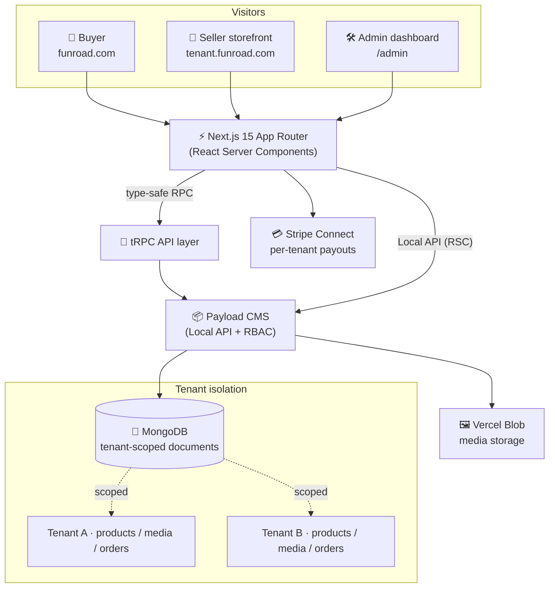

<div align="center">

# 🛍️ Funroad — Multi-Tenant E-Commerce Marketplace

**A production-grade, multi-tenant marketplace where any creator can launch their own branded storefront, sell digital products, and get paid — built end to end with Next.js 15, Payload CMS, and Stripe Connect.**


</div>

---

## ✨ Overview

**Funroad** is a full-stack, multi-vendor marketplace modeled on platforms like Gumroad. Every seller (a **tenant**) gets an **isolated storefront** on their own sub-domain, manages their own catalog, and receives payouts through their own **Stripe Connect** account — while the platform owner keeps a unified super-admin view across all tenants.

This project is engineered to demonstrate real-world SaaS patterns: **tenant isolation, role-based access control, type-safe APIs, server-first rendering, and integrated payments** — the same building blocks behind modern commercial products.

> **Why it matters:** this is not a toy demo. It's a scalable, secure, multi-tenant foundation that can be white-labeled into a niche marketplace, a creator platform, or a SaaS product.

---

## 🏬 Multi-Tenant Architecture (the core)

Funroad implements a **shared-database, shared-schema multi-tenancy** model — the most cost-efficient and scalable SaaS pattern — with strict **tenant scoping** enforced at the data layer.



### How tenancy works

| Concern | Implementation |
|---|---|
| **Tenant model** | A `Tenants` collection holds each store's `name`, `slug` (sub-domain), branding image, and `stripeAccountId`. |
| **Data scoping** | `@payloadcms/plugin-multi-tenant` automatically scopes tenant-owned collections (`products`, `media`) so a seller can only ever read/write **their own** records. |
| **Membership** | Each `User` carries a `tenants[]` relationship — users can belong to one or more stores, enabling teams per tenant. |
| **Sub-domain routing** | Storefronts resolve via `tenant.<root-domain>` (toggle with `NEXT_PUBLIC_ENABLE_SUBDOMAIN_ROUTING`), with a graceful `/tenants/[slug]` path fallback for local development. |
| **Access control (RBAC)** | A `super-admin` role can manage **all** tenants; regular users are confined to their own. Enforced centrally via `userHasAccessToAllTenants` + collection-level access rules. |
| **Per-tenant payments** | Every tenant onboards its own **Stripe Connect** account, so funds flow directly to the seller while the platform can take application fees. |

This means a new seller can **sign up → get an isolated store → list products → accept payments** without ever touching another tenant's data.

---

## 🚀 Features

- 🏪 **Multi-tenant storefronts** — isolated, branded stores per seller on sub-domains
- 🔐 **Authentication & RBAC** — secure cookie-based auth with role-aware permissions
- 🗂️ **Nested categories & tags** — rich, filterable taxonomy with subcategories
- 🔎 **Powerful product discovery** — search, price range, tag filters, and sorting (curated / trending / hot)
- ⭐ **Ratings & reviews** — verified-purchase reviews with rating distribution
- 🛒 **Cart & checkout** — persistent per-tenant cart with Stripe-powered checkout
- 📚 **Customer library** — buyers access their purchased digital products
- 🛠️ **Admin dashboard** — Payload-powered CMS for catalog, orders, and tenants
- 💳 **Stripe Connect** — per-seller onboarding and payouts with platform fees
- 🎨 **Modern, responsive UI** — accessible components, light theme, smooth interactions

---

## 🧱 Tech Stack

| Layer | Technology |
|---|---|
| **Framework** | Next.js 15 (App Router, React Server Components, Server Actions) |
| **Language** | TypeScript (end-to-end type safety) |
| **CMS / Backend** | Payload CMS 3 (headless, code-first) |
| **Database** | MongoDB via Mongoose adapter |
| **API** | tRPC 11 + TanStack Query (typed client/server contract) |
| **Auth** | Payload authentication (HTTP-only cookies, RBAC) |
| **Payments** | Stripe Connect |
| **Validation** | Zod + React Hook Form |
| **State / URL** | Zustand (cart) · nuqs (type-safe URL search params) |
| **Styling** | Tailwind CSS v4 + shadcn/ui (Radix primitives) |
| **Media** | Vercel Blob storage |
| **Rich text** | Lexical editor |

---

## 🗂️ Project Structure

The codebase follows a **modular, feature-first architecture** — each domain is self-contained with its own UI, server procedures, types, and hooks.

```
src/
├── app/
│   ├── (app)/                 # Storefront, auth, tenants, library, marketing pages
│   │   ├── (home)/            # Marketplace home + category routes
│   │   ├── (auth)/            # Sign-in / sign-up
│   │   ├── (tenants)/         # Per-tenant storefronts & checkout
│   │   ├── (library)/         # Purchased products
│   │   └── (pages)/           # About / Contact
│   └── (payload)/             # Payload admin panel & REST/GraphQL APIs
├── collections/               # Payload schema: Users, Tenants, Products, Categories, Orders, Reviews…
├── modules/                   # Feature modules (auth, products, checkout, reviews, library, home…)
│   └── <feature>/
│       ├── ui/                # Views & components
│       ├── server/            # tRPC procedures
│       ├── hooks/ · store/    # Client logic
│       └── types.ts
├── trpc/                      # tRPC routers, server & client setup
├── lib/                       # Stripe, access control, utilities
└── payload.config.ts          # Payload + multi-tenant plugin configuration
```

---

## 🔌 Architecture & Data Flow

- **Server-first rendering** — pages are React Server Components that fetch data through Payload's Local API (no network hop) and **prefetch + hydrate** tRPC queries for instant, SEO-friendly loads.
- **End-to-end type safety** — a single source of truth flows from the MongoDB schema → Payload types → tRPC procedures → React, so the compiler catches mistakes before runtime.
- **Optimistic, cache-aware UX** — TanStack Query handles caching, infinite scrolling, and background revalidation; URL state is fully shareable via `nuqs`.

---

## ⚙️ Getting Started

### Prerequisites
- Node.js 20+ (or 22 LTS)
- A MongoDB instance (local or Atlas)
- *(Optional)* Stripe account for live payments, Vercel Blob token for uploads

### 1. Clone & install
```bash
git clone https://github.com/suleman-the-stammer/implementation.git
cd implementation
npm install   # (uses legacy-peer-deps for the React 19 ecosystem)
```

### 2. Configure environment
```bash
cp .env.example .env
```
Fill in the values (see the table below).

### 3. Seed demo data *(optional)*
```bash
npm run db:seed   # creates categories, an admin tenant & user
```

### 4. Run the app
```bash
npm run dev
```
- 🛍️ Storefront → http://localhost:3000
- 🛠️ Admin → http://localhost:3000/admin

---

## 🔑 Environment Variables

| Variable | Description |
|---|---|
| `DATABASE_URI` | MongoDB connection string |
| `PAYLOAD_SECRET` | Secret used to sign auth tokens |
| `NEXT_PUBLIC_APP_URL` | Public app URL (e.g. `http://localhost:3000`) |
| `NEXT_PUBLIC_ROOT_DOMAIN` | Root domain for tenant sub-domains |
| `NEXT_PUBLIC_ENABLE_SUBDOMAIN_ROUTING` | `true` to serve storefronts on sub-domains |
| `STRIPE_SECRET_KEY` | Stripe secret key (Connect) |
| `STRIPE_WEBHOOK_SECRET` | Stripe webhook signing secret |
| `BLOB_READ_WRITE_TOKEN` | Vercel Blob storage token (media uploads) |

---

## 📜 Scripts

| Script | Description |
|---|---|
| `npm run dev` | Start the development server |
| `npm run build` | Production build |
| `npm run start` | Run the production server |
| `npm run lint` | Lint the codebase |
| `npm run generate:types` | Generate Payload TypeScript types |
| `npm run db:seed` | Seed the database with demo data |

---

## 👤 Author

**Suleman** — Full-Stack Software Engineer (MERN · MEAN · Next.js · DevOps)

Building fast, reliable, production-ready web products. Open to freelance work and collaborations.

- 📧 **Email:** [sulemanthestammer@gmail.com](mailto:sulemanthestammer@gmail.com)
- 📱 **Phone:** [+92 302 9026786](tel:+923029026786)
- 💻 **GitHub:** [@suleman-the-stammer](https://github.com/suleman-the-stammer)

> Like what you see? Imagine what I could build for **your** business. Let's talk.

---

<div align="center">
<sub>Built with ❤️ and a focus on clean, scalable architecture.</sub>
</div>
